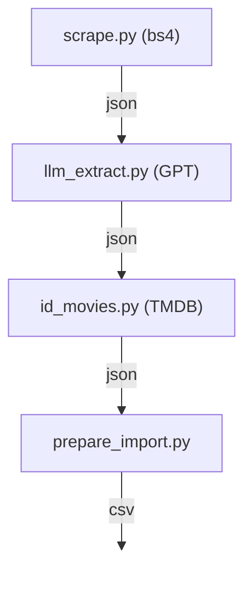

# roxie-theater

Fetches showtimes from the [Roxie Theater](https://roxie.com/calendar/) website and prepares an import for Letterboxd.

[at the Roxie](https://letterboxd.com/eugeually/list/at-the-roxie/) list will be sporadically updated with this data. Lack of Letterboxd API means this needs to be done manually or with browser automation.

## Implementation

See [`fetch`](.github/workflows/fetch.yml) Github Action for cron. 
Relies on GPT and TMDB APIs. 
`OPENAI_API_KEY` and `TMDB_TOKEN` env vars required. 
Python and deps managed with Rye.

 
 

## Disclaimer

Unofficial project from a Roxie Theater and Letterboxd fan.
